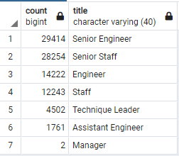
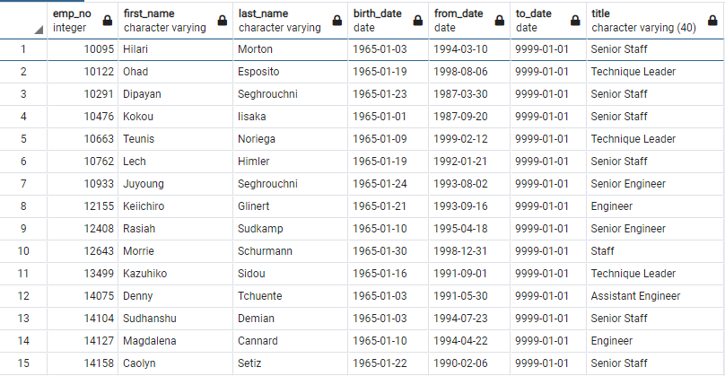
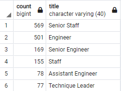

# Pewlett-Hackard-Analysis

## Description
- Design an ERD that will apply to the data
- Create and use a SQL database
- Import and export large CSV datasets into pgAdmin
- Write basic to intermediate level SQL statements

---

## Overview
In this analysis we will be identifying several groups of indivudals to prepare for a wave of retirement. These tables will give us accurate data to work with to prepare visualization for management so that they can identifity where hiring and training will need to be focued.

---

## Results
In preparing this data we needed to clean out duplicate data and get the most recent titles for employees that have moved around. Our tables were structured as follows.
- Retrieve number of employees by most recent job title who are about to retire
    - Perform inner join on employees and titles table
    - On above join create a table where birth dates are between 1952 and 1955, called retirement_titles
    - Use Distinct and Orderby to remove duplication rows, named unique_titles
    - Retrieve count of employees by most recent job titles who are about to reire, named retiring_titles from unique_titles



- Create Mentorship Eligibility table that holds employees are are eligible to participate in the program
    - Use Distinct to grab unique employees
    - Join dept_emp table on emp_no
    - Join titles on emp_no
    - Use date 9999-01-01 on to_date and range 1965-01-01 to 1965-12-31 to to define eiligibility for program. Put this into table named mentorship_eligibility



---

## Summary

Using the above data lets derive some conclusions. 
### How many roles will need to be filled as the "silver tsunami" begins to make an impact?
Since we already have the number of retiring employees by title, we can use the following query to get the total employees retiring.
```
SELECT SUM(count)
FROM retiring_titles;
```
This gives us a total of 90398! That is a lot of people retiring!

### Are there enough qualified, retirement-ready employees in the departments to mentor the next generation of Pewlett Hackard employees?
Here we are going to create a new table. Let us call it mentorship_by_titles. This table will give us the total number of employees by title that will be eligible to mentor. We used the following query to make this table.
```
SELECT COUNT(title), title
INTO mentorship_by_titles
FROM mentorship_eligibility
GROUP BY title
ORDER BY COUNT(title) DESC;
```


This is significantly less than those who are retiring! We are way behind the curve in mentoring individuals with these numbers, as some roles such as the Senior Engineer's will be mentoring around 170 people per mentor! That is an impossible number! We also have 2 Manager's retiring, and no availible mentors! 

This information tells us we are not preparred to take on such task alone. It might be in the companies best intrest to bring in a consulting firm to tackle the massive undertaking of mentoring employees while those eligible can work along side them for ensuring best practices are kept. 